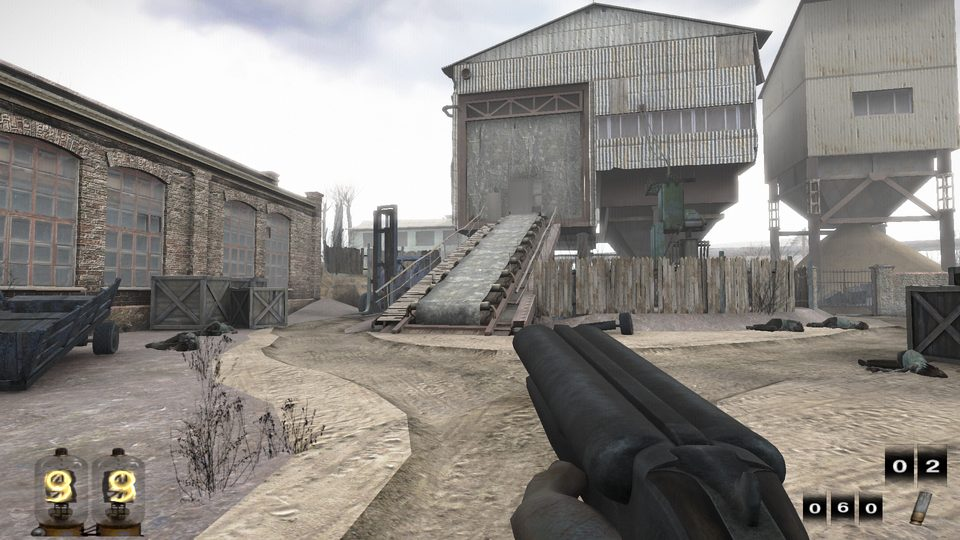
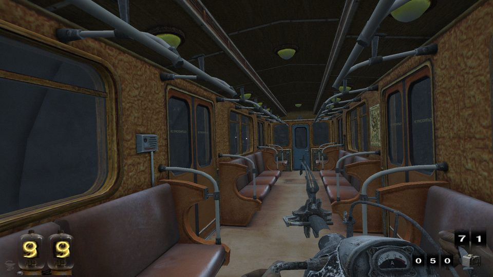
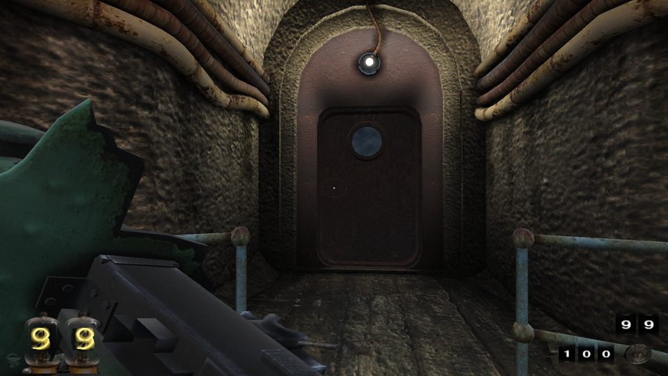
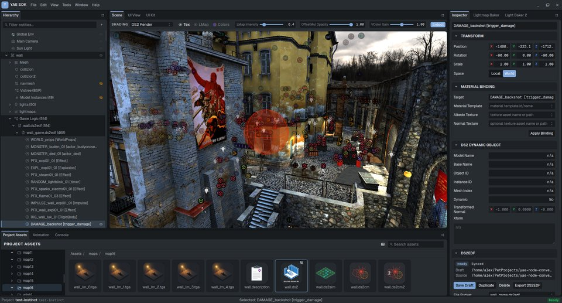
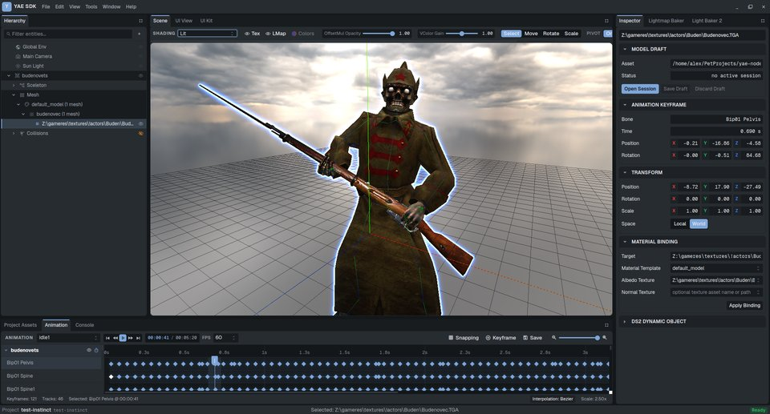
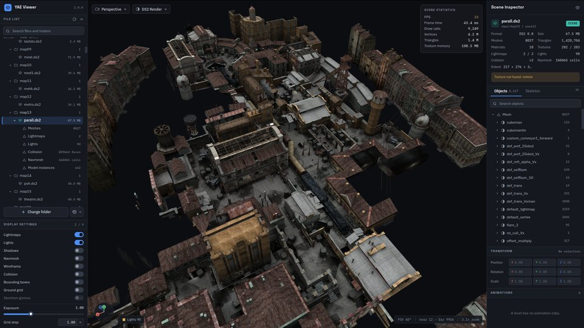
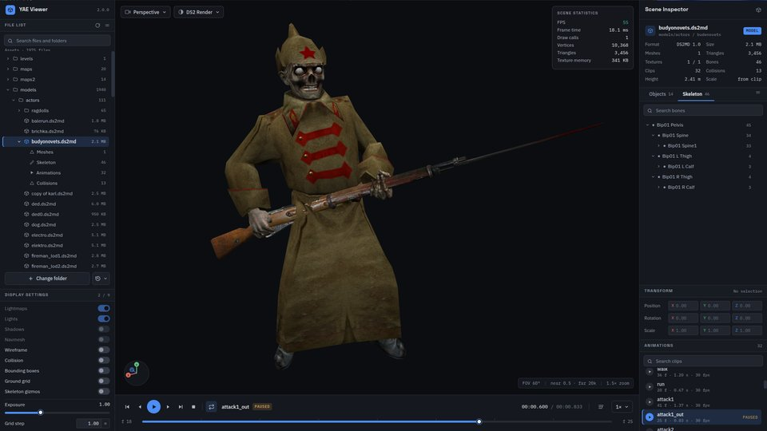

<div align="center">

<!-- TODO: logo. The game's title is a ready visual metaphor: an empty silhouette, an empty city. -->

# Project Empty

**An independent open-source community initiative building a modern engine, an SDK and modding
tools for *You Are Empty* (2006)**

[]()
[]()

[English](README.md) · [Русский](README.ru.md) · [Українська](README.uk.md)

</div>

---

## What this is

*You Are Empty* is a 2006 first-person shooter by the Kyiv studios Digital Spray Studios and
Mandel ArtPlains (published by 1C in the CIS and Atari in the West) that never got a sequel. Its
engine, the DS2 Engine, is closed and its sources are gone. Project Empty is a community that takes
the original apart and rebuilds its legacy in open form:

- a **new engine** that runs the original game data on a modern stack (C++20, SDL3, OpenGL 4.5,
  Jolt, Lua 5.4) — Windows and Linux from one code base;
- an **SDK**: a level editor and converters to open formats (glTF, OBJ) — modding and Blender;
- **specifications of the game's formats**, recovered by reverse engineering;
- a **community PBR material catalog** over the original textures — one piece of modding work,
  results in the native renderer and in RTX Remix alike;
- **graphics mods for the original game**: `yae-dlss5` brings DLSS 5 Neural Rendering to the
  original 32-bit OpenGL build.

We are not affiliated with the rights holders and distribute no game assets. The repositories
live in the [OpenYAE](https://github.com/OpenYAE) organization on GitHub.

| | | |
|---|---|---|
|  |  |  |

<sub>The new engine on the original game's files: `kolhoz`, `met6`, `lastzlo`.</sub>

## Who writes it

Most of the code and of the documents of Project Empty were written by AI agents — Anthropic's
Claude (through Claude Code) and OpenAI's Codex — under the direction of the project's maintainer,
who sets the goals, plays the original and the new engine side by side, records the reference
sessions, decides every question of behaviour and look, and reviews the work. We do not hide it;
it is why the repositories carry agent instructions (`CLAUDE.md`, skills) and why every change is
handed in with measurements and a gate rather than a description. Contributions — by hand or with
an agent — follow the same rules: [CONTRIBUTING.md](CONTRIBUTING.md).

## Repositories

| Repository | What is inside | State (2026-10-05) |
|---|---|---|
| [`yae-engine`](https://github.com/OpenYAE/yae-engine) | The new engine: loads the original levels, models, animations, sound and scripts; Lua logic compatible with the original's prototypes; Jolt physics by the rules of the original's ODE; reads the original `.ds2gsf` saves; menus, a developer console, self-tests, CI | Active: the whole campaign — 24 levels from the main menu, with saves, films and comics — plays on the original files; Release 1 in preparation |
| [`yae-sdk`](https://github.com/OpenYAE/yae-sdk) | The format library (TypeScript), a desktop level editor (Electron/React/Three.js), CLI converters (`.ds2md` → glTF/GLB with skeleton and animations, `.ds2` → OBJ and back, collisions, navmesh), a lightmap baker and a browser viewer | Working; the reference the engine compares its parsers against |
| [`yae-materials`](https://github.com/OpenYAE/yae-materials) | The PBR material catalog: neutral JSON records, deterministic map baking, exporters for the engine, Remix and glTF; AI generation as one backend | MVP |
| [`yae-viewer`](https://github.com/OpenYAE/yae-viewer) | A browser viewer for the game's levels (with lightmaps, collisions, navigation) and models (with skeleton and animations); nothing leaves the browser | Live at [openyae.github.io/yae-viewer](https://openyae.github.io/yae-viewer/) |
| [`yae-docs`](https://github.com/OpenYAE/yae-docs) | The documentation portal (Docusaurus, English with Russian and Ukrainian locales): glossary, conventions, the format registry, the roadmap; the Engine/SDK/Materials/Research sections are assembled from the repositories | Filling |
| [`yae-research`](https://github.com/OpenYAE/yae-research) | Reverse-engineering notes on the DS2 Engine: architecture, interface registration, vtables, structures, formats, game logic. Descriptions only; the decompiled originals never leave a private workspace | Public since 2026-09-18 |
| [`yae-level-converter`](https://github.com/OpenYAE/yae-level-converter) | The first C++ converter of levels and models to OBJ; the lightest tool for a quick export | Maintained, in use by the community |
| [`yae-dcc-plugins`](https://github.com/OpenYAE/yae-dcc-plugins) | 2013 plugins for 3ds Max and Maya importing `.ds2md` models | Unmaintained; the SDK's glTF path replaces it; a maintainer is welcome |
| [`yae-QindieGL`](https://github.com/OpenYAE/yae-QindieGL) | A QindieGL fork: OpenGL → Direct3D 9 for running the *original* under RTX Remix and DLSS | Experiment |
| [`yae-dlss5`](https://github.com/OpenYAE/yae-dlss5) | DLSS 5 Neural Rendering for the *original* 32-bit OpenGL game: the frame goes through ReShade x86, a 32-bit feeder, a 64-bit D3D12 host and OptiScaler to DLSS/DLAA with Neural Rendering. A one-command PowerShell installer fetches the NVIDIA runtime from its source, checks hashes and signatures, backs up what it replaces and can restore it; needs an RTX 50 GPU | Experiment, public |

## Workspace layout

This repository is the workspace's root: the ecosystem's README, `CONTRIBUTING.md`, the agents'
`CLAUDE.md` and `bootstrap.sh`, which clones the other repositories into it. Each of them is a
repository of its own with its own gate. The engine's — `build.sh --check`, its scripts, `render.cfg`
and the agent skills — live in the engine, and its commands run from `yae-engine/`. The engine finds
its neighbours beside it (`../yae-game/gameres`, `../yae-materials/export/engine/catalog.yaemat`,
`../yae-sdk/sdk-desktop`), the portal assembles its sections from them (`sources.json`), and a missing
neighbour is skipped with a warning.

```
project-empty/             this repository: README, CLAUDE.md, bootstrap.sh
├── yae-engine/            the engine, its gates ┐
├── yae-sdk/               the SDK               │
├── yae-materials/         the material catalog  │ bootstrap.sh clones them (Release 1)
├── yae-docs/              the portal            │
├── yae-research/          the research notes    │
├── yae-viewer/            the viewer            ┘
├── yae-QindieGL/  yae-dcc-plugins/  yae-level-converter/  yae-dlss5/     bootstrap.sh --all
└── yae-game/              your copy of the game (not in git; gameres ≈ 8.5 GB)
```

## Engine highlights

- Loads the original resources completely: levels, models, animations, textures, scripts, sound,
  video — nothing needs converting.
- Game logic in Lua, compatible with the original's prototypes: AI, FSM behaviour, triggers,
  cutscenes, scripted level scenes.
- Jolt physics by the rules of the original's ODE 0.5: hinges, ropes, conveyors, lifts, ragdolls
  (the reference is the meat-plant level with its crane).
- Reads the **original saves** (`.ds2gsf`) and writes its own.
- The original's menus, key binds and settings files; films decoded in-process (FFmpeg's
  libavcodec); a developer console; self-tests at startup; a gate of 24 levels (smoke plus pixel
  comparison); CI on Linux and Windows.
- Windows and Linux from one code base (SDL3).

## SDK and viewer

| | |
|---|---|
|  |  |
|  |  |

<sub>Top: the SDK's level and model editors (`yae-sdk`). Bottom: the browser viewer (`yae-viewer`) on the
`parall` level and a model.</sub>

## Quick start

> You need the files of your own copy of the game (retail or the re-release). The game's
> resources are not part of any repository.

**To play:** download the package for Linux or Windows from the engine's
[releases](https://github.com/OpenYAE/yae-engine/releases), unpack it into your game's folder (next to
`gameres`) and start `run.sh` or `run.bat`; its `README.txt` says the rest.

**To build and work on it** — from nothing to a running level:

```bash
git clone https://github.com/OpenYAE/project-empty && cd project-empty
bash bootstrap.sh                  # clones the engine, the SDK, the catalog, the portal, the notes, the viewer
cp -r "/path/to/You Are Empty" yae-game    # your copy of the game: the folder that holds gameres/
(cd yae-sdk/sdk-desktop && npm install)   # the SDK's parsers: the gate compares the engine's with them
cd yae-engine                      # the engine's commands run from here
bash build.sh                      # the engine (dev preset): downloads and builds its dependencies once
bash run_level.sh -map med1        # a level; ./build/yae-engine --root ../yae-game/gameres for the menu
bash build.sh --check              # every gate, before a commit
```

What the build needs (CMake 3.25+, Ninja, GCC 13+ or Clang 17+, SDL3's system packages) is in the
engine's [README](https://github.com/OpenYAE/yae-engine#readme); `CLAUDE.md` is the map of the workspace.

SDK:

```bash
cd yae-sdk && npm install
npx tsx index.js model -i actor.ds2md -o out/actor.glb    # a model with skeleton and animations
npx tsx index.js level -i map.ds2 -o out/level            # a level to OBJ
```

## Roadmap

| Milestone | Content |
|---|---|
| **v0.1 Playable** | the campaign end to end, Windows/Linux builds, an installation guide |
| **v0.2 Modding** | stable converters, format specifications v1, the community PBR material catalog |
| **v0.3+** | by feedback: the editor, graphics mods |

## About the official re-release

A re-release on Steam is good news: it brings the game an audience again, and it is the copy of the
game our projects will run on. We do something else: open code, Linux, modding tools and what a
re-release cannot give. Our projects complement it; they do not compete with it.

## Legal

- **Licenses.** Each repository states its own license: GPL-3.0-or-later for the engine; MIT for
  the SDK, the material catalog's code, the viewer and the documentation portal; CC BY 4.0 for the
  documentation and the research notes; WTFPL for the DCC plug-ins, as their original authors chose;
  the QindieGL fork stays GPL-3.0 as upstream. This repository: MIT for its scripts
  ([LICENSE](LICENSE)), CC BY 4.0 for its text ([LICENSE-docs](LICENSE-docs)), see [NOTICE](NOTICE).
- **Assets.** The game's levels, models, textures and sound belong to their rights holders and are
  **not distributed**: use the files of your own copy.
- **Trademarks.** *You Are Empty* and the related marks belong to their owners; the project is not
  affiliated with them and claims nothing.
- **Reverse engineering.** The decompiled code, the original binaries and the Ghidra project live in
  a private workspace and are never published. The public repositories hold only the results of
  analysis: descriptions of formats, interfaces and behaviour. A reference such as `FUN_0f8a7940`
  (a function's address in the original binary) or `+0xa34` (a field offset) is a pointer to
  evidence anyone can check with their own copy of the game and a disassembler, not the code itself.

## Contributing

See [CONTRIBUTING.md](CONTRIBUTING.md): how the projects work (one phase per level, gates before
commits), the language policy (English first, translations welcome), what a good bug report looks
like, and the two rules that never bend — no game assets, no decompiled code.

## Acknowledgements

- Digital Spray Studios, Mandel ArtPlains and 1C — for the game itself.
- The community that kept the game alive for almost twenty years.
- The projects we stand on: SDL, Jolt, Lua, glm, miniaudio, stb, Mesa, DXVK, Docusaurus and many more.

<div align="center">
<sub><em>"You are empty" — and that is only the beginning.</em></sub>
</div>
